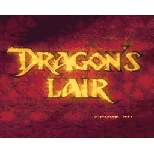
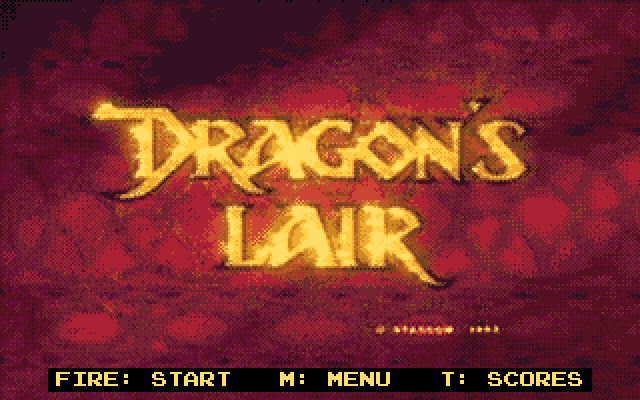
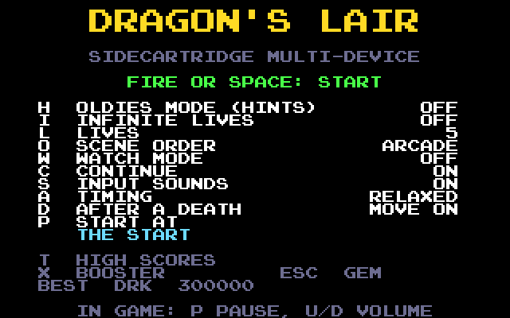
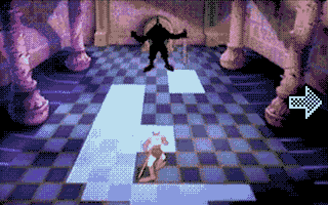
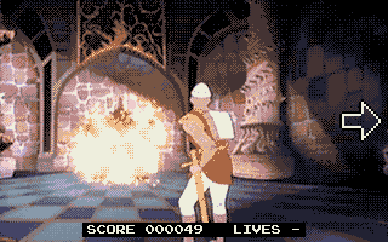
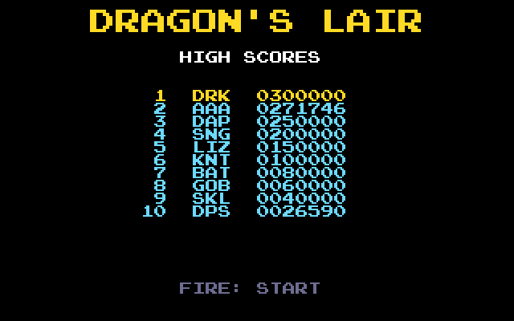

<div align="center">



# Dragon's Lair for the SidecarTridge Multi-device

[](https://github.com/sidecartridge/md-dragons-lair/actions/workflows/build.yml)
[](https://github.com/sidecartridge/md-dragons-lair/actions/workflows/release.yml)
[](LICENSE)

</div>

Dragon's Lair, the 1983 laserdisc game, on an Atari ST, STE, Mega ST or Mega STE with a
[SidecarTridge Multi-device](https://sidecartridge.com) in its cartridge slot: Dirk the Daring,
Princess Daphne and Singe the dragon, the whole cartoon full screen at 25 pictures a second with
its sound, played on the joystick or the keyboard by the arcade's rules.

<p align="center"></p>

The Raspberry Pi Pico (RP2040) in the cartridge plays the game's clips from the SD card,
converted once for the machine it is plugged into: each picture 320×200 in 16 colours of its own,
from the STE's 4,096 colours or the ST's 512. The sound plays through the DMA sound chip on an
STE or a Mega STE, through the YM2149 elsewhere. The game's logic is
[DirkSimple](https://github.com/icculus/DirkSimple)'s.

## What you need

- Your own copy of the game's PC CD-ROM, as an ISO 9660 image: **Dragon's Lair CD-ROM
  (Version 3.1)** by Digital Leisure, the only one that works. None of the game's clips or sound
  is in this repository or in the firmware. If your own disc no longer reads after all these
  years, the Internet Archive keeps a copy for preservation: look for "Dragon's Lair CD-ROM
  (Version 3.1)" on archive.org.
- A SidecarTridge Multi-device, and a microSD card with room for the clips: 535 MB for an STE or
  a Mega STE, 546 MB for an ST or a Mega ST.
- An Atari ST, STE, Mega ST or Mega STE with a colour monitor (low or medium resolution), and
  the keyboard or a joystick in the joystick port.

## Quick start

1. Install Dragon's Lair on the Multi-device from its app store.
2. Make the clips: open **<https://md-dragons-lair.sidecartridge.com>** on a computer, give it
   the CD-ROM image and let it write the clips onto the card, in a few minutes. Or copy the
   image into the card's `DLAIR` folder and let the cartridge convert it at the first start,
   in about an hour.
3. Put the card in the Multi-device and switch the ST on: the clips are checked, then the
   attract movie plays.
4. Fire, Space or Return to play; M for the start menu and its options. Esc goes back to GEM,
   X in the start menu back to the Multi-device's menu.

**[The user guide](docs/guide.md)** has everything else: the options, how to play, the high
scores and what to do when something goes wrong.

<table>
  <tr>
    <td></td>
    <td></td>
  </tr>
  <tr>
    <td align="center">The start menu: every option on a key</td>
    <td align="center">Oldies mode shows the move to make</td>
  </tr>
  <tr>
    <td></td>
    <td></td>
  </tr>
  <tr>
    <td align="center">The score and the lives at each scene</td>
    <td align="center">The ten best, kept on the cartridge</td>
  </tr>
</table>

## Building it

```bash
# ./build.sh <board> <build_type> <app_uuid>
#   board:      pico_w
#   build_type: debug | release
#   app_uuid:   the app's UUID4 (desc/app.json); 44444444-4444-4444-8444-444444444444 for
#               local builds
./build.sh pico_w release 44444444-4444-4444-8444-444444444444
```

The firmware is `dist/<APP_UUID>-<VERSION>.uf2`. It needs the ARM GNU Toolchain 14.2
(`PICO_TOOLCHAIN_PATH`), and the `atarist-toolkit-docker` (`stcmd`) for the ST's side. The first
build clones the submodules (pico-sdk, pico-extras, fatfs-sdk). The app plays at 25 frames a
second; `APP_PROFILE=PROFILE_50FPS ./build.sh ...` builds the 50 fps profile.

- `make -C tests/host test` runs the host tests (the pure logic, on your computer, in a second
  or two); CI runs them and both builds on every pull request.
- `tools/dlconv/dlconv.c` is the cartridge's decoder and converter on a PC, for comparing its
  output with a reference decoder (its commands are at the top of the file). It builds with the
  host's compiler:

  ```bash
  mkdir -p build/dlconv
  cc -std=c11 -O2 -Wall -Wextra -Werror -Wno-unknown-pragmas -I rp/src/include \
     tools/dlconv/dlconv.c rp/src/mpeg1_video.c rp/src/mpeg_ps.c rp/src/crc32.c \
     rp/src/picture16.c rp/src/mp2_audio.c rp/src/cadence.c rp/src/convert.c \
     rp/src/clip.c rp/src/game_table.c -o build/dlconv/dlconv
  ```
- `web/` is the same converter in WebAssembly and its page: `web/build.sh` builds it (Emscripten
  in Docker), and `web/build.sh test` checks its output against the native build's. Every push
  to `main` or a release branch publishes it at <https://md-dragons-lair.sidecartridge.com>,
  each converter version in its own folder.
- With a Raspberry Pi Debug Probe on the cartridge's SWD and debug UART, `tools/dev/` builds,
  flashes and checks the firmware, captures its console and drives a debug build's bench from
  the host: see [`tools/dev/README.md`](tools/dev/README.md).

## How it is made

The app is built on [md-framebuffer-template](https://github.com/sidecartridge/md-framebuffer-template)
v1.1.0, whose framework does the ST's side: the frame the RP draws, one byte per pixel, is
converted to the ST's planes and copied to the screen every frame, and the keyboard, the mouse,
the joysticks and the sound go through the cartridge. The template's README is the guide to that
framework's API. [`CLAUDE.md`](CLAUDE.md) describes this repository's code, the framework's
internals included. The Multi-device's programming documentation is at
<https://docs.sidecartridge.com/sidecartridge-multidevice/programming/>.

## Acknowledgements

This project builds on the work of others, with thanks:

- **[DirkSimple](https://github.com/icculus/DirkSimple)** by Ryan C. Gordon (zlib licence): the
  game's logic, its scenes, sequences, move windows, deaths and points, comes from DirkSimple's
  `game.lua`, its re-creation of the arcade game from the original ROM's data (vendored unchanged
  in `third_party/dirksimple`).
- **[SNES Super Dragon's Lair Arcade](https://github.com/astrobleem/SNES-SuperDragonsLairArcade)**
  by Chad Doebelin (MIT licence): its laserdisc segment table (`segment_timing.json`) is how the
  laserdisc's frames, which DirkSimple's sequences start at, are found in the CD-ROM's clips
  (vendored unchanged in `third_party/snes-superdragonslairarcade`).
- **[pl_mpeg](https://github.com/phoboslab/pl_mpeg)** by Dominic Szablewski (MIT licence): the
  MPEG-1 video and MP2 audio decoding tables (`tools/gen_mpeg1_tables.py`,
  `tools/gen_mp2_tables.py`).
- **[QR Code generator](https://www.nayuki.io/page/qr-code-generator-library)** by Project Nayuki
  (MIT licence): the QR code on the screen without clips (`rp/src/qrcodegen.c`, unchanged).
- **[md-framebuffer-template](https://github.com/sidecartridge/md-framebuffer-template)** and
  md-microfirmware-template by SidecarTridge: the framework this app is built on.

Dragon's Lair itself (Cinematronics, 1983, animated by Don Bluth) is not part of this project:
the app plays the clips of the player's own copy of the CD-ROM.

## License

GPL v3.0: see [LICENSE](LICENSE).
