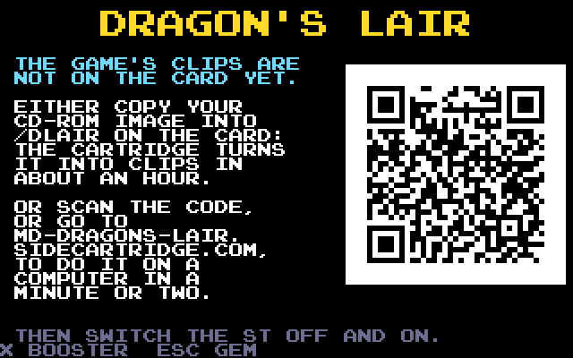
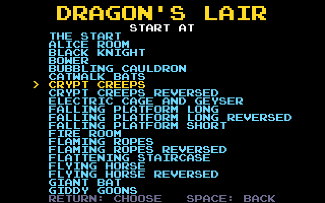
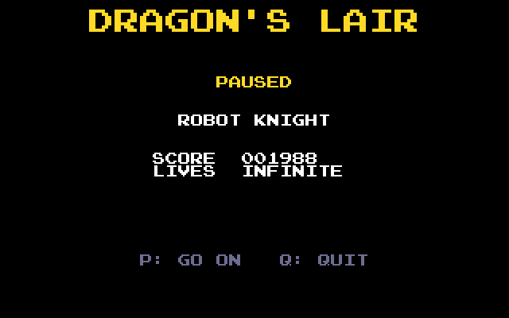
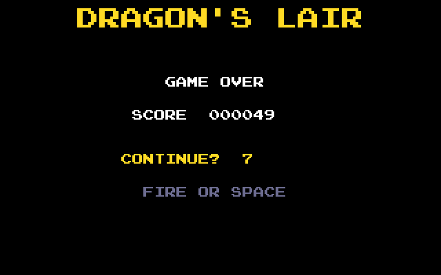

# Dragon's Lair: the user guide

Dragon's Lair on an Atari ST, STE, Mega ST or Mega STE with a SidecarTridge Multi-device: what
you need, how the game's clips get onto the card, and how to play. The pictures are taken from
a Mega STE, as the ST shows them.

- [What you need](#what-you-need)
- [The clips on the card](#the-clips-on-the-card)
- [Switching on](#switching-on)
- [The start menu](#the-start-menu)
- [Playing](#playing)
- [Game over, the continue and the high scores](#game-over-the-continue-and-the-high-scores)
- [Troubleshooting](#troubleshooting)

## What you need

- **The game's PC CD-ROM, as an ISO 9660 image:** Dragon's Lair CD-ROM (Version 3.1) by Digital
  Leisure (`DL_CDROM_V31.ISO`, about 600 MB). It is the only edition that works. If your own disc
  no longer reads after all these years, the Internet Archive keeps a copy for preservation: look
  for "Dragon's Lair CD-ROM (Version 3.1)" on archive.org.
- **A SidecarTridge Multi-device** with Dragon's Lair installed from its app store, and a microSD
  card in it with room for the clips: 535 MB for an STE or a Mega STE, 546 MB for an ST or a
  Mega ST, both if the card goes from one machine to the other.
- **An Atari ST, STE, Mega ST or Mega STE** with a colour monitor, in low or medium resolution
  (in high resolution the app returns to GEM with a message). The keyboard, or a joystick in the
  joystick port.

## The clips on the card

The game is the CD-ROM's 194 video clips, converted once for the machine they will play on: 320
by 200 pixels in 16 colours chosen for each picture (from the STE's 4,096 colours, or the ST's
512), at 25 pictures a second, with their sound. The converted clips live in the card's `DLAIR`
folder, `DLAIR/STE` for an STE or a Mega STE and `DLAIR/ST` for an ST or a Mega ST. There are two
ways to make them.

### On a computer, in a few minutes

Open **<https://md-dragons-lair.sidecartridge.com>** in a desktop browser, with the card in the
computer:

1. Choose the CD-ROM image. The page checks that it is the right one.
2. Tick the machines: STE, ST, or both.
3. Choose where the files go: straight onto the card (choose the card, or its `DLAIR` folder:
   Chrome and Edge can) or a `DLAIR.zip` to unzip at the top of the card (any browser).
4. Convert. The page uses your computer's cores; a few minutes for both sets on a recent
   computer. Nothing is uploaded: the image stays on your computer.

### On the cartridge, in about an hour

Copy the image into the card's `DLAIR` folder and switch the ST on. At every start the cartridge
checks the clips for the machine it is plugged into and converts those missing: the first time,
the whole game, about an hour (56 minutes on a Mega STE). The screen shows the clip being
converted, the progress of the whole game and the time left; the ST can be left alone. Space
stops it, and the next start carries on where it stopped. When the image is on the card the app
looks for `DL_CDROM_V31.ISO`, then for any `.ISO` in the folder that holds the game.

Once a set is complete the image is no longer needed: the app plays the clips without it.

### No clips yet

With neither the clips nor the image on the card, the start says so and shows a QR code: it
opens the web converter, set for the machine the cartridge is plugged into. Convert the clips,
put the card back and switch the ST off and on.

## Switching on

At every start the app checks the clips on the card (a few seconds), then the attract movie
plays with its sound, as the arcade's did between games.

| Key | In the attract movie |
| --- | --- |
| Fire, Space or Return | start a game |
| M | the start menu |
| T | the high scores |
| U / D | the volume up or down |
| Esc | back to GEM |

After the movie the start menu comes up by itself; left alone for 20 seconds it goes back to the
movie.

## The start menu

Every option has a key of its own and is saved on the cartridge. Fire, Space or Return starts a
game.

| Key | Option | What it does |
| --- | --- | --- |
| H | Oldies mode | Draws the move that passes over the picture: an arrow at the edge of the screen for a direction, at a corner for a diagonal, the sword in the middle. An outline while the move is still to come, filled while it can be pressed. |
| I | Infinite lives | Dirk never runs out of lives. |
| L | Lives | The lives a game starts with, 1 to 5. |
| O | Scene order | Arcade: a scene of each row at random, as the arcade does. Fixed: always the same order. |
| W | Watch mode | The game plays itself, every move right. Any key, or fire, goes back to the menu. |
| C | Continue | After game over, ten seconds to carry on with the game, the lives back and the score at 0. |
| S | Input sounds | A blip when a move is taken, a buzz for a move pressed when none is expected. |
| A | Timing | Relaxed (the default): a move pressed up to a quarter of a second after its moment still counts. Arcade: the arcade's moments exactly. |
| D | After a death | Move on: the next scene, as the arcade does; the scene you died in comes back later. Retry: the same scene again until you pass it or run out of lives. |
| P | Start at | The scene a game starts at, from the list below. |
| T | High scores | The table of the ten best. |
| X | Booster | Back to the Multi-device's menu (the ST resets into it). |
| Esc | GEM | Back to the desktop, from the menu or anywhere in the game. |

**Start at** lists the start and every scene, the reversed ones (the arcade's mirrored rooms)
included. Up and Down move, Left and Right a page, Return chooses, Space goes back without
changing.

## Playing

Dirk follows the **joystick in the joystick port** (the mouse's port is not used) or the
**cursor keys**, and swings his sword with **fire** or **Space**. Two directions at once make a
diagonal, on the stick or the keys.

Each scene is a short cartoon. At each danger there is a moment to move: the right direction, or
the sword, while it lasts, and Dirk goes on; a wrong one, or none, and he dies. A move pressed
too early is ignored, so pressing again is fine. A few dangers are about timing itself, such as
the falling platform's jumps: the right move at the wrong moment is a death there, as in the
arcade.

At the start of each scene the score and the lives show for three seconds:

With oldies mode on, the move to make is drawn over the picture. Here, in the robot knight's
room, the arrow says right, filled because now is the moment:

| Key | In a game |
| --- | --- |
| Joystick, or the cursor keys | the directions |
| Fire, or Space | the sword |
| P | pause: the scene, the score and the lives (P goes on, Q quits to the menu) |
| U / D | the volume up or down, from -18 to +18 dB, kept for the next time |
| Esc | back to GEM |

The arcade's own secret works too: hold up and left as the game starts, and Dirk has infinite
lives.

The scenes come in thirteen rows, a scene of each row in turn, three times through; the scenes
Dirk died in come back before the last one, the dragon's lair. Rescue Princess Daphne to win.

## Game over, the continue and the high scores

When the last life is lost, the scene's game over plays. With **Continue** on, ten seconds count
down: fire or Space carries on with the game, the lives back and the score at 0 (with retry on,
from the scene that was lost).

A score among the ten best asks for initials: up and down change a letter, left and right move
between them, fire or Return ends. The table is kept on the cartridge; T shows it from the attract
movie and the menu, and it shows by itself after a game.

Games in watch mode do not enter the table.

## Troubleshooting

- **The ST starts GEM without the game.** Switch it off and on again: the cartridge must be
  ready when the ST looks for it. In high resolution the app returns to GEM with a message:
  switch to low or medium.
- **The screen asks for the clips, or says they are for an older version.** The clips are
  missing, or were made by an older converter: make them again (see
  [the clips on the card](#the-clips-on-the-card)), or leave the image on the card and let the
  cartridge convert what is needed.
- **The screen says NO SD CARD.** Put the card in the Multi-device and switch the ST off and on.
- **The screen says some clips are not converted yet.** A conversion was stopped, or a clip
  failed (a full card): C converts those missing, or the next start does.
- **The joystick does nothing.** It must be in the joystick port, not the mouse's.
- **A scene seems impossible.** Try oldies mode (H) to see the moves, the relaxed timing (A),
  retry (D) to practise a scene, or start at it (P).
- **The card fills up while converting.** A set takes 535 MB (STE) or 546 MB (ST), the image
  596 MB; once a set is complete the image can go.
- **The cartridge's SELECT button** restarts the cartridge with a short press (then reset the
  ST); held for 10 seconds it is a factory reset of the Multi-device's settings.
- **Back to the Multi-device's menu**: X in the start menu, or the SELECT button.
